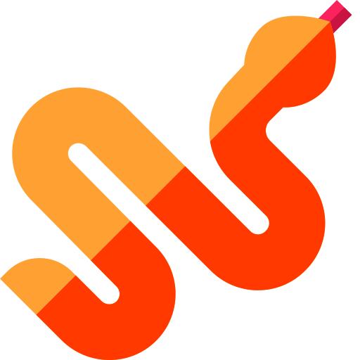
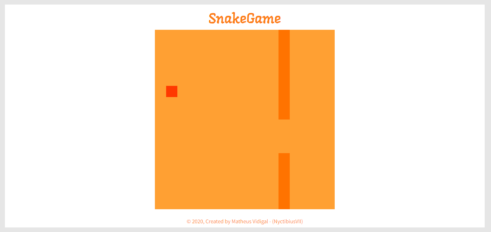
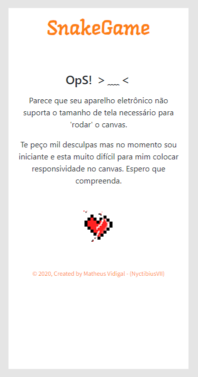

<h4 align="center">
  <br>
    
</h4>
<p align="center">
  
  
  <a href="https://github.com/NyctibiusVII/SnakeGame/blob/master/LICENSE">
    
  </a>
  <a href="https://picpay.me/Matheus_nyctibius_vii">
  
  </a>
</p>
<p align="center">
  <a href="#SnakeGame-">Projeto</a>&nbsp;&nbsp;&nbsp;|&nbsp;&nbsp;&nbsp;
  <a href="#tecnologias-">Tecnologias</a>&nbsp;&nbsp;&nbsp;|&nbsp;&nbsp;&nbsp;
  <a href="#layout-">Layout</a>&nbsp;&nbsp;&nbsp;|&nbsp;&nbsp;&nbsp;
  <a href="#licença-%EF%B8%8F">Licença</a>
</p>

# SnakeGame 🐁🐍
Projeto desenvolvido para a conclusão do curso Recriando o jogo da cobrinha com JavaScript. @DigitalInnovationOne.


## Tecnologias 🚀
Esse projeto foi desenvolvido com as seguintes tecnologias:

- [Html](https://pt.wikipedia.org/wiki/HTML)
- [Css](https://pt.wikipedia.org/wiki/Cascading_Style_Sheets)
- [Javascript](https://pt.wikipedia.org/wiki/JavaScript)
- [Bootstrap](https://getbootstrap.com/)

## Layout 🚧
#### Desktop Screenshot
<div>
<!-- Responsive, 1366 x 768, 50% (Lenovo Ideapad 310)-->
   
</div>

#### Mobile Screenshot
<div>
<!-- Responsive, 360 x 720, 50% (Moto G6 Play)-->
   
</div>

### Como jogar? 🕹
Você controla uma cobrinha cujo objetivo é comer o máximo possível sem se chocar com o próprio corpo.

#### Regras
Restrições: você não pode executar um comando contrario do sentido da sua cobra. *Ex: sua cobra esta indo para a direita, então sera impossível executar o comando de ir para a esquerda.*

#### Desktop
Cobra controlada por 'setinhas': cima ↑, direita →, baixo ↓, esquerda ←. "isso ja é auto sugestivo".

Disponível em breve no formato 'W, S, A, D'.

#### Mobile
*Disponível em breve...*

##### Responsividade do mobile 📱
- Para **dispositivos com width(largura) abaixo de 540** infelizmente a tela do canvas fica desregulada.

```
OpS! ＞﹏＜

Parece que seu aparelho eletrônico não suporta o tamanho de tela necessário para 'rodar' o canvas.

Te peço mil desculpas mas no momento sou iniciante e esta muito difícil para mim colocar responsividade no canvas.Espero que compreenda.
```
- Virar a tela é uma opção para acessar o layout do jogo, mas ainda impossível jogar.

- Para dispositivos mobile não é possível jogar por enquanto devido a inexistência de botões para movimentar a cobra

## Rodando o projeto 🚴🏻‍♂️
#### "Só vou dar uma olhadinha...":
  <a href="https://picpay.me/Matheus_nyctibius_vii">🍉 Site hospedado na Vercel 🍉</a>

#### Na sua maquina:

```bash

# Clone o repositório
$ git clone https://github.com/NyctibiusVII/SnakeGame.git

# Acesse a pasta do projeto no prompt de comando
$ cd SnakeGame

# Para executar o projeto basta abrir o html com seu navegador.
```

## Contribuição 💭
Para construir essa aplicação tive a ajuda da professora **Gabriela Pinheiro** da DigitalInnovationOne que disponibilizou video aulas do projeto **"Recriando o jogo da cobrinha com JavaScript"**.

## Licença ⚖️
Este projeto está sob a licença do MIT. Veja o arquivo [LICENSE](https://github.com/NyctibiusVII/SnakeGame/blob/master/LICENSE) para mais detalhes.

## Contato ✉️
| <br><sub><a href="https://www.instagram.com/nyctibius_vii/?hl=pt-br">@MatheusVidigal🦊</a></sub> |
| :---: |

<p align="left">
   <a href="https://www.linkedin.com/in/matheus-vidigal-nyctibiusvii/">
      
   </a>
   <a href="https://mail.google.com/mail/u/1/#inbox?compose=GTvVlcSGLCKpKJfwPsKKqzXBplKkGtCLvCQcFWdWxCxQFfkHzzjVkgzrMFPBgKBmWFHvrjrCsMqSH">
      
   </a>
</p>